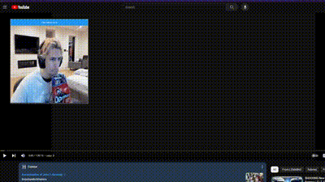

# XqcReacts
Add a transformative XQC reation to anything you are doing!

  

&nbsp;

Has XQC not reacted to content you like? Here is the solution. Add XQC's **transformative** reaction to any piece of content. You can even change the Gif to fit your favorite streamer!

You can add this plain JavaScript to the GreaseMonkey extension or make it an extension of its own. Nothing too fancy with a lot of bugs still.

## Notes
* Move the reaction square by grabbing it by the header
* Can also move it by double clicking the reaction square
* Resize it by using the notch on the bottom right corner

&nbsp;

